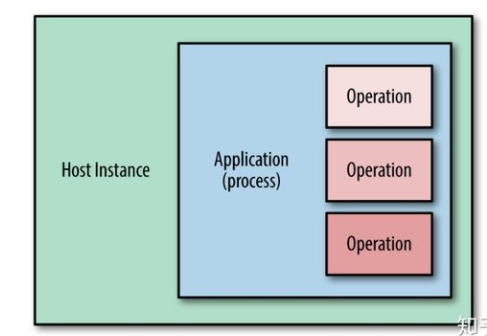
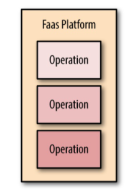

What is serverless?

简单的说Serverless=BaaS+FaaS。

BaaS就是用现成的第三方服务替换我们原来自己编码实现或者自己搭建的服务器端组件，它在概念上更接近于Software as a Service（SaaS），不同之处在于SaaS通常是关于外包业务流程，比如人力资源或销售工具，或者像Github这样的产品，然而对于BaaS来说，实际上是我们将我们的应用程序分解成更小的组件，并将其中一部分组件用第三方提供的服务来完成，这个第三方服务通常就叫做BaaS。
BaaS服务是通过API远程调用的组件，而不是SDK，或者Library，我们通过远程API的调用，来完成我们的应用程序的一部分功能。这里的一个很好的例子是身份验证，许多应用程序实现自己的代码来实现注册，登录，密码管理等功能，但是这些代码在很多应用程序中非常相似，同样的事情无数的公司和团队做过了无数遍，已近非常成熟了，可以把它们抽象出来变成一个第三方公共服务再好不过，这正是Auth0和亚马逊的Cogono等产品的目标，这两种产品都允许任何人，不需要写一行代码的情况，就可以在移动应用程序和Web应用程序上实现非常完善的身份验证和用户管理功能。

FaaS
Serverless的另一半是FaaS, FaaS是Compute as a Service的另一种形式，概念上容易混淆的地方在于，AWS有时候将自己的FaaS服务，Lambda，称为Serverless Compute。

传统方式部署服务器端软件

FaaS改变了这种部署模式（如下图）， 部署模型中少了主机实例和应用程序进程，我们只关注实现应用程序逻辑的各个操作和函数，我们将这些函数代码单独上传到云供应商提供的FaaS平台。

但是，这些函数在云服务托管的服务器进程中缺省处于空闲状态，直到需要它们运行的时候才会被激活（如下图）， 通过配置FaaS平台来监听每个函数的激活事件。 当该事件发生时，FaaS平台实例化函数，然后使用触发事件调用它。一旦该函数执行结束了，理论上FaaS平台可以销毁掉实例，不过，通常为了优化性能，会
将函数实例保留一段时间，可以被下一个事件复用。

完全使用Serverless架构的应用程序，将不再需要考虑服务器或者进程，应用程序的所有逻辑，无论您是自己编写的，还是与第三方服务集成的部分，都运行在完全弹性的环境中，状态也采用以类似弹性的形式存储，无服务器并不意味着服务器已经消失，这只是意味着着您不再需要关心它们了。

serverless中文的含义是 "无服务器"，但是它真正的含义是开发者再也不用过多考虑服务器的问题，但是并不代表完全去除服务器，而是我们依靠第三方资源服务器后端，比如使用 Amazon Web Services(AWS) Lambda. 计算服务来执行代码，那么Serverless架构分为 Backend as a Service(BaaS) 和 Functions as a Service(FaaS) 两种技术，Serverless 它是由开发者实现的服务端逻辑运行在无状态的计算容器中，它是由事件触发，完全被第三方管理的。

Serverless的应用架构是将BaaS和FaaS组合在一起的应用，用户只需要关注应用的业务逻辑代码，编写函数为粒度将其运行在FaaS平台上，并且和BaaS第三方服务整合在一起，最后就搭建了一个完整的系统。整个系统过程中完全无需关注服务器。

在Serverless架构中，应用业务逻辑是基于FaaS架构形成多个相互独立的功能组件的。并且以API服务的形式向外提供服务，在FaaS中，后端的应用被拆分成为一个个函数，我们只需要编写完成函数后部署到serverless服务即可。后续我们也不用关心任何服务器的操作。
居于 AWS Lambda 中编写代码，AWS中支持不同的语言。 Lambda计算服务它能够以大规模并行的方式执行代码来响应事件。通过使用Lambda以及使用各种功能强大的API和Web服务，开发者可以快速的构建松耦合，可扩展性及高效的架构体系。
Lambda是什么？它是一种计算服务，它在AWS基础上执行用javascript、node.js、Python、C#或java编写的代码，源代码将被打包并部署到孤立的容器中，该容器有单独分配的内存、磁盘空间和处理器。代码、配置和依赖项的组合被称作为Lambda函数。
